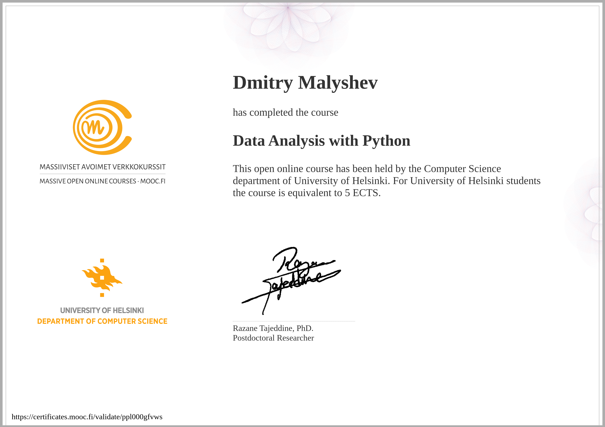

# MOOC: Data Analysis with Python 2021, University of Helsinki

This repository contains exercises and project work that I completed as part of the "Data Analysis
With Python" course offered by University of Helsinki.

Course page: <https://dap-21.mooc.fi/>

## Minimum environment setup to run exercises

- python3.10 or more
- python modules:
  [requirements.txt](https://raw.githubusercontent.com/csmastersUH/data_analysis_with_python_summer_2021/main/requirements.txt)
  (for more details see
  [Initializing course environment](https://dap-21.mooc.fi/initializing-course-environment))
- [tmc cli](https://github.com/testmycode/tmc-cli)

## How to run exercises

To run a single exercise:

- `cd <EXERCISE_DIR>`
- `python3 src/xxx.py` or `tmc test`

To run all exercises: `tmc test` in the root directory

## Project work and certificate

Project work:

<https://certificates.mooc.fi/validate/ppl000gfvws>
